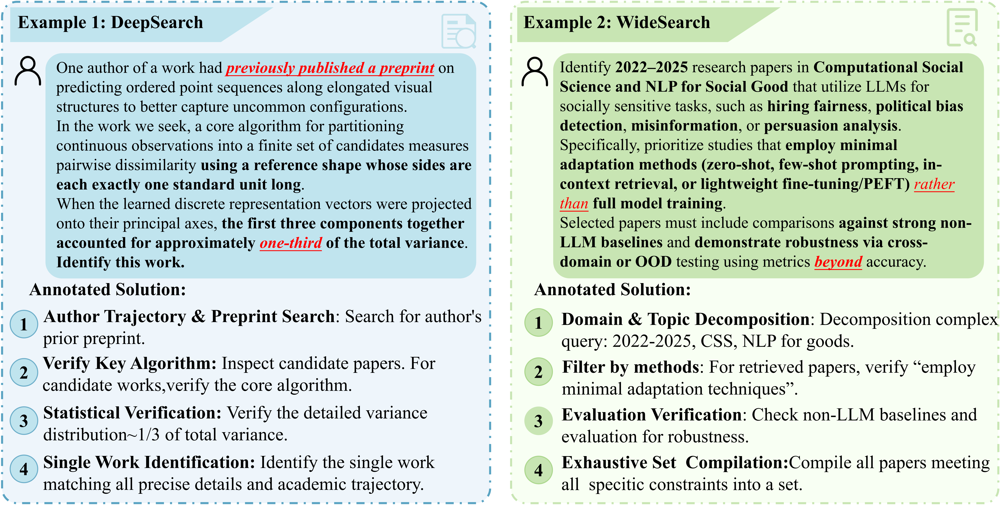
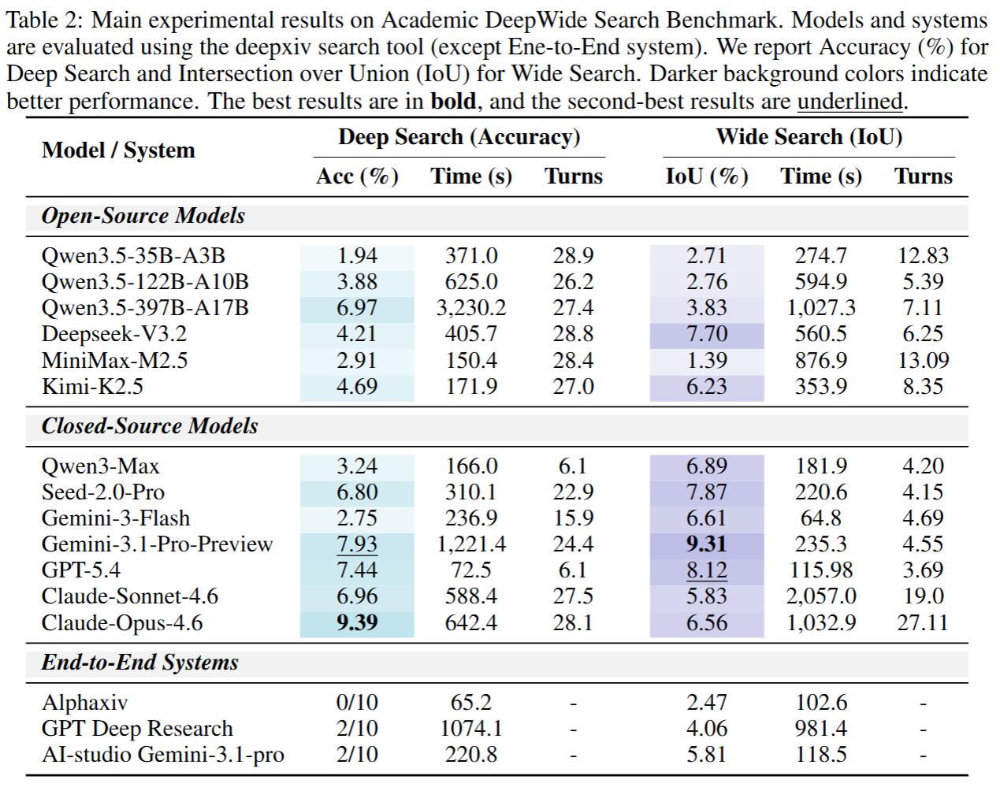

<h1 align="center">AutoResearchBench</h1>

<p align="center"><a href="README.md">English</a> · 简体中文</p>

<div align="center">

<strong>AutoResearchBench基准的推理与评测参考实现。</strong>

<br />
<br />

<a href="#快速开始">
  
</a>
<a href="https://huggingface.co/datasets/Lk123/AutoResearchBench">
  
</a>
<a href="#基准数据">
  
</a>
<a href="#仓库结构">
  
</a>

<br />
<br />


</div>

## 概要

借助AI智能体的发展，自主科学研究取得了显著进展。这一过程中的关键一步是找到合适的科学文献，无论是为研究问题探索现有知识，还是获取证据以验证假设和支持主张。

为评估AI智能体推动这一过程的能力，我们提出了**AutoResearchBench**，一个专门用于自主科学文献发现的基准。

AutoResearchBench 包含两种互补的任务类型：
- **深度研究**：需要通过渐进式、多步骤的探索过程，追踪定位一篇特定的目标论文。
- **广泛研究**：需要全面收集满足给定条件的一组论文。

与先前针对智能体网页浏览的基准相比，AutoResearchBench在三个维度上独具特色：它是*研究导向*的，要求深入理解科学概念；它*聚焦文献*，要求精细利用详细信息；它*开放性强*，涉及数量未知的合格论文，因此需要全程进行审慎推理和搜索。这些特性使AutoResearchBench特别适用于评估自主研究能力，并且极具挑战性。

即使是最强大的大语言模型，虽已在BrowseComp等通用智能体网页浏览基准上基本被攻克，但在深度研究上的准确率仅为9.39%，广泛研究上的交并比（IoU）仅为9.31%，而其他许多强大的基线模型则低于5%。我们公开发布数据集与评估流程，以促进该方向的未来研究。

## 图示

构造流程（示意）。矢量版：[`assets/construction-pipeline.pdf`](assets/construction-pipeline.pdf)。


Benchmark 案例示意。矢量版：[`assets/autoresearchbench-cases.pdf`](assets/autoresearchbench-cases.pdf)。



主实验结果汇总（表中在统一协议下以 DeepXiv 检索工具评测；端到端系统另行列出）。下图来自论文材料的表格导出：



## 仓库结构

| 图标 | 组件 | 作用 |
| --- | --- | --- |
| 🚀 | `run_inference.sh` + `inference.py` | 批推理入口，配置由 `.env` 驱动。 |
| 🔎 | `tool_deepxivsearch.py` + `tool_websearch.py` | 学术检索与通用网页检索后端。 |
| 🧠 | `prompts.py` + `utils.py` | 共享提示词、模型客户端与 JSONL 工具函数。 |
| 📊 | `evaluate/evaluate_deep_search.py` + `evaluate/evaluate_wide_search.py` | Deep Search 判定与 Wide Search 检索指标。 |
| 🔓 | `decrypt_benchmark.py` + `benchmark_crypto.py` | 将发布的 `.obf.json` 在本地还原为明文 JSONL。 |
| 🗂️ | `input_data/` + `output_data/` | 示例输入与推理输出。 |

## 快速开始

1. 安装依赖：

```bash
python3 -m pip install -r requirements.txt
```

2. 复制环境变量模板：

```bash
cp example.env .env
```

3. 在 `.env` 中填写必要字段：

```bash
MODEL=your_model_name
OPENAI_API_KEY=your_api_key
OPENAI_API_BASE=your_api_base
INPUT_FILE=input_data/academic_deepsearch_example.jsonl
```

4. 运行推理：

```bash
bash run_inference.sh
```

5. 运行评测：

```bash
bash evaluate/run_evaluate.sh deep --input-file output_data/inference_output.jsonl
bash evaluate/run_evaluate.sh wide --input-file output_data/inference_output.jsonl --gt-file path/to/gt.jsonl
```

## 基准数据

公开发布的数据包托管于 Hugging Face 数据集仓库 [`Lk123/AutoResearchBench`](https://huggingface.co/datasets/Lk123/AutoResearchBench)。

### 1. 下载发布包

```bash
mkdir -p input_data

curl -L \
  -o input_data/AutoResearchBench.jsonl.obf.json \
  https://huggingface.co/datasets/Lk123/AutoResearchBench/resolve/main/AutoResearchBench.jsonl.obf.json
```

若你将数据包镜像到私有 Hugging Face 仓库，可在 `curl` 命令中额外添加 `-H "Authorization: Bearer ${HF_TOKEN}"`。

### 2. 本地解密

```bash
python3 decrypt_benchmark.py \
  --input-file input_data/AutoResearchBench.jsonl.obf.json \
  --output-file input_data/AutoResearchBench.jsonl
```

### 3. 将推理输入指向解密后的 JSONL

```bash
INPUT_FILE=input_data/AutoResearchBench.jsonl
```

> [!NOTE]
> Hugging Face 上发布的是混淆包；请对已解密的 `.jsonl` 运行推理，不要直接对已混淆的 `.obf.json` 调用推理流程。

## 引用

若在研究中使用本基准或本仓库代码，请在正式论文发表后按其版本信息引用；并遵守 Hugging Face 数据集页面的许可与署名要求。

## 许可证

本仓库使用 Apache License 2.0 发布，详见 [`LICENSE`](LICENSE)。

## 说明

- 推理会跳过输出 JSONL 中已存在的题目。
- `run_inference.sh` 与 `evaluate/run_evaluate.sh` 默认从 `.env` 读取配置；可通过 `AUTORESEARCHBENCH_ENV_FILE` 指定其他环境文件。
- 调试时可在 Python 入口使用 `--verbose` 获取更详细的日志。
